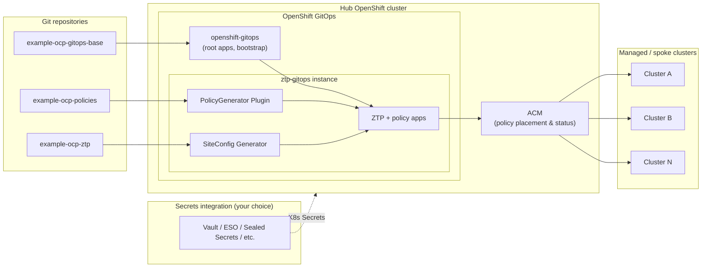
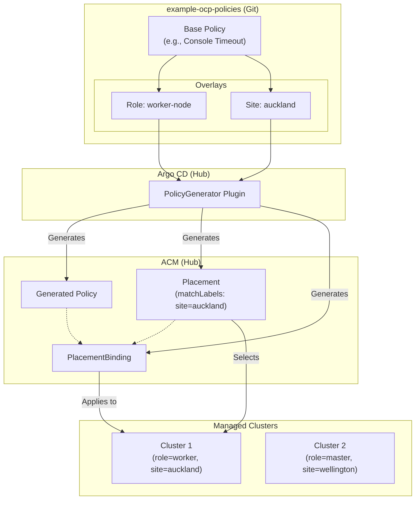

# Architecture: OpenShift cluster configuration and lifecycle with GitOps

This document describes the reference pattern for managing OpenShift clusters on the hub and at the edge using **Red Hat Advanced Cluster Management (ACM)**, **OpenShift GitOps (Argo CD)**, and **Zero Touch Provisioning (ZTP)**. The design splits responsibilities across three Git repositories so platform, policy, and site-specific concerns stay clear and auditable.

---

## 1. OpenShift cluster configuration and lifecycle management with GitOps

Git is the source of truth for **what** should run and **how** clusters should be configured. The hub cluster runs OpenShift GitOps to reconcile Git-defined Applications and ApplicationSets, and ACM to place generated policies on managed clusters and report compliance. ZTP connects provisioning (bare metal or assisted flows) to that same declarative model: install-time manifests and post-install policy keep clusters aligned with fleet standards without ad hoc cluster-by-cluster changes.

Together, this yields:

- **Repeatable** cluster bring-up and baseline configuration
- **Observable** drift and remediation through policy status and GitOps sync state
- **Scalable** fleet operations through policy sets, placements, and templated cluster selection

Repository roots for this reference:

- [`example-ocp-gitops-base`](https://github.com/federated-fleet-forge/example-ocp-gitops-base)
- [`example-ocp-policies`](https://github.com/federated-fleet-forge/example-ocp-policies)
- [`example-ocp-ztp`](https://github.com/federated-fleet-forge/example-ocp-ztp)

---

## 2. Day 0 / Day 1 / Day 2 lifecycle stages

### Day 0 — Cluster deployment (ZTP)

**Goal:** Provision a new cluster from declared site and cluster specs with minimal manual steps.

Typical prerequisites:

- **BMC connectivity** — management network reachability to baseboard controllers (for example Redfish).
- **BIOS/firmware** — boot order, virtualization, and security settings appropriate for OpenShift and your hardware profile.
- **Networking** — L2/L3 design for provisioning and cluster networks; DHCP or static plans as required by your topology.
- **DNS and NTP** — resolvable API and application ingress names; time sync for certificates and distributed components.

ZTP-driven flows consume manifests from the ZTP repository (for example `SiteConfig`, `BareMetalHost`, `AgentClusterInstall`) and hub-side automation (ACM provisioning) to drive installation.

For lab environments without physical BMC hardware, the [sushy-lab](https://github.com/ngner/sushy-lab) repository provides Sushy Redfish emulator setup and libvirt VM creation scripts. The emulator exposes standard Redfish virtual-media endpoints that ACM assisted installer consumes identically to real baseboard controllers. A worked example site config targeting Sushy-backed VMs is provided under `siteconfigs/libvirt-lab/` in the ZTP repository.

### Day 1 — Initial configuration (ZTP extra-manifests and PolicyGenerator)

**Goal:** Apply baseline Kubernetes and OpenShift configuration as soon as the cluster is viable—before or shortly after the node is production-ready.

- **ZTP extra-manifests** deliver custom resources at install time where supported, reducing unnecessary reboots and ensuring critical items (for example networking or early-day operators) exist from first boot.
- **PolicyGenerator** on the hub turns structured policy inputs into ACM `Policy`, `PolicySet`, and binding objects, with ordering and dependencies expressed in generator configuration rather than hand-maintained YAML at scale.

Day 1 closes the gap between “cluster installed” and “cluster matches organizational baseline.”

### Day 2 — Ongoing lifecycle (ACM policies, PolicyGenerator, TALM)

**Goal:** Continuously enforce and upgrade configuration across the fleet.

- **ACM policies** express desired state (configuration, compliance checks, optional remediation) per cluster or cluster groups.
- **PolicyGenerator** keeps policy artifacts consistent and composable as the fleet grows.
- **Topology Aware Lifecycle Manager (TALM)** orchestrates rolling updates (for example upgrades tied to `ClusterGroupUpgrade`), so changes land in a controlled order across groups of clusters.

This reference emphasizes **PolicyGenerator** for policy authoring; operators evolve generated policies and placements in Git, and the hub reconciles them to managed clusters.

---

## 3. GitOps functions

| Function | Characteristics | Example use case |
| --- | --- | --- |
| **ZTP extra-manifest** | Delivers CRs during install; avoids extra reboots where possible; can establish networking and early cluster settings at boot | Node network configuration or initial operator subscriptions needed before workloads land |
| **PolicyGenerator** | Groups policies into `PolicySet`s; reconciles with dependency ordering; surfaces enforce/compliance status on managed clusters | Fleet-wide OAuth, monitoring, or security baselines with shared generator definitions |
| **OpenShift GitOps (Argo CD)** | Directly enacts Git state on the hub; **ApplicationSets** enable dynamic discovery (for example per-cluster or per-label apps) | Hub bootstrap, ZTP GitOps instance, and policy-application wiring from Git |

---

## 4. Three-repo pattern

Why three repositories instead of one monolith? A single monorepo approach often fails due to Git's repository-wide RBAC limitations and the dangers of mixing platform code with edge configuration.

| Repository | Role | Typical owners |
| --- | --- | --- |
| **[`example-ocp-gitops-base`](https://github.com/federated-fleet-forge/example-ocp-gitops-base)** | Hub bootstrap: OpenShift GitOps wiring, root **app-of-apps**, **ApplicationSets**, and the ZTP GitOps Argo CD instance definitions. Single entry point for “what runs on the hub to drive everything else.” | Platform team |
| **[`example-ocp-policies`](https://github.com/federated-fleet-forge/example-ocp-policies)** | ACM **PolicyGenerator** sources organized by concern (for example **AC** access control, **CM** configuration management, **SC** system and communications protection). Produces policy bundles consumed by placements and lifecycle tooling. | Platform team (write); Engineering teams may read and propose changes via PR |
| **[`example-ocp-ztp`](https://github.com/federated-fleet-forge/example-ocp-ztp)** | Cluster install manifests, **cluster-specific** configuration, site configs, and **pre-flight** checks (BMC, network validation). Close to data center and network reality. | Platform team (write); Network and Data Centre teams may read and propose changes via PR |

### The Monorepo Anti-Pattern

- **The RBAC/Security Failure:** Git permissions apply to the *entire repository*. If all configurations lived in a single monorepo, you would be forced to give Network and Data Centre teams (who just need to update a site's IP address in ZTP) write access to the same repository that holds the root Argo CD `RoleBindings` and `ServiceAccounts`. A simple PR mistake could accidentally grant someone cluster-admin across the entire fleet.
- **The Monorepo App-of-Apps Problem:** Starting with a single repo leads to an unacceptable blast radius. A bad PR meant for a single edge site could break the root ApplicationSet, halting GitOps reconciliation fleet-wide.
- **UI and Tooling Failure:** Argo CD instances and AppProjects are split to enable appropriate teams access to the UIs and to control what resources can be applied. A monorepo makes it incredibly difficult to map separate Argo CD instances (like the `gitops-root` vs the `ztp` instance) to different RBAC boundaries, especially when they require different or conflicting Argo CD plugins (e.g., PolicyGen vs PolicyGenTemplate).
- **Code vs. Config:** Separating the structural GitOps wiring (platform "code") from the day-to-day policy/ZTP values (site "config") keeps the platform stable while allowing rapid iteration on the edge. Splitting them prevents tangled Git histories and noisy PRs.

Separation reduces blast radius: hub GitOps layout can evolve without rewriting every policy; site-specific install data stays out of generic policy repos; policy categories stay reviewable by security and platform standards. Physical repository separation is the only robust way to enforce RBAC boundaries for the root App-of-Apps.

---

## 5. Secrets management

This reference is **secrets-management-agnostic**. It does not mandate a particular product. Instead, it assumes the required **Kubernetes `Secret` objects** exist in the correct namespaces with the keys the policies and Argo CD repositories expect.

You may populate those secrets using any approach your organization allows, for example:

- HashiCorp Vault with a Kubernetes integration
- Bitnami Sealed Secrets
- External Secrets Operator
- Cloud provider secret stores with sync into the cluster
- CI/CD pipelines or runbooks that apply secrets
- Manual creation for lab or proof-of-concept environments

See [`secrets-inventory.md`](./secrets-inventory.md) for a consolidated list of secret names, keys, and consumers.

---

## 6. Architecture diagram

The following diagram summarizes data flow: Git sources on the left, hub GitOps and ACM in the center, managed clusters on the right, and an external secrets integration supplying cluster secrets without prescribing a vendor.

**Reading the diagram:** `openshift-gitops` deploys and owns the high-level Application graph including the ZTP GitOps instance. The `ztp-gitops` instance uses the **PolicyGenerator** and **SiteConfig** plugins to process the **policies** and **ztp** repositories. ACM consumes generated policies and pushes desired state to spokes; compliance and sync status close the loop back to operators via ACM and Argo CD UIs and APIs.

---

## 7. Policy Generation and Placement Concepts

The `PolicyGenerator` plugin enables a highly scalable overlay model. Instead of writing duplicate policies for every cluster, you write a single base policy and use overlays to apply specific values to clusters based on their role or site.

The following diagram illustrates how `PolicyGen` files use overlays (e.g., base, role-specific, site-specific) to generate policies and placements that target specific managed clusters.

**Reading the diagram:** The `PolicyGenerator` plugin reads the base policy and the specific overlays from Git. It dynamically generates the ACM `Policy`, `Placement`, and `PlacementBinding` resources on the Hub. The `Placement` resource uses label selectors (e.g., `role=worker`) to ensure the policy is only distributed to the correct managed clusters.
